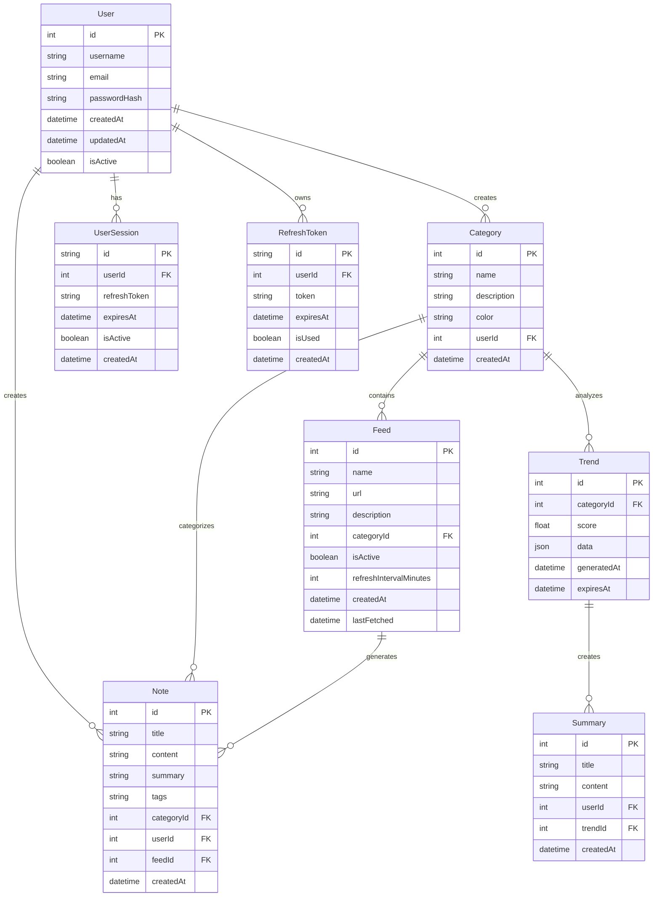

# 🗄️ Schéma de Base de Données - PulseWatch

## 📊 Vue d'Ensemble

PulseWatch utilise une architecture de base de données relationnelle conçue pour stocker et analyser des flux d'informations technologiques.



## 📋 Tables Détaillées

### 👤 **Users**
Gestion des comptes utilisateurs et authentification.

**Champs principaux :**
- `id` : Identifiant unique
- `username` : Nom d'utilisateur unique
- `email` : Email unique pour login
- `passwordHash` : Mot de passe hashé (bcrypt)
- `isActive` : Compte actif/bloqué

**Relations :**
- Un utilisateur peut créer plusieurs catégories
- Un utilisateur peut créer plusieurs notes
- Un utilisateur a plusieurs sessions

---

### 📁 **Categories**
Organisation thématique du contenu.

**Champs principaux :**
- `id` : Identifiant unique
- `name` : Nom de la catégorie (ex: "IA", "Cloud", "Cybersécurité")
- `description` : Description détaillée
- `color` : Code couleur pour l'UI
- `userId` : Créateur de la catégorie

**Exemples :**
- "Intelligence Artificielle" (bleu)
- "Cloud Computing" (vert)
- "Cybersécurité" (rouge)
- "Développement Web" (orange)

---

### 📡 **Feeds**
Sources RSS/Atom de flux d'informations.

**Champs principaux :**
- `id` : Identifiant unique
- `name` : Nom du flux (ex: "TechCrunch AI")
- `url` : URL du flux RSS/Atom
- `categoryId` : Catégorie associée
- `isActive` : Flux actif ou en pause
- `refreshIntervalMinutes` : Fréquence de récupération
- `lastFetched` : Dernière récupération réussie

**Exemples :**
- RSS de TechCrunch
- Flux de blog d'OpenAI
- Actualités GitHub

---

### 📝 **Notes**
Contenu généré à partir des flux ou créé manuellement.

**Champs principaux :**
- `id` : Identifiant unique
- `title` : Titre de la note
- `content` : Contenu complet
- `summary` : Résumé généré par IA
- `tags` : Étiquettes (JSON array)
- `categoryId` : Catégorie associée
- `userId` : Auteur
- `feedId` : Flux source (optionnel)

**Types de notes :**
- Notes automatiques (générées depuis les feeds)
- Notes manuelles (créées par l'utilisateur)
- Notes enrichies (avec résumé IA)

---

### 📈 **Trends**
Analyses de tendances par catégorie.

**Champs principaux :**
- `id` : Identifiant unique
- `categoryId` : Catégorie analysée
- `score` : Score de tendance (0-100)
- `data` : Données détaillées (JSON)
- `generatedAt` : Date de génération
- `expiresAt` : Date d'expiration

**Données dans `data` :**
```json
{
  "keywords": ["AI", "machine learning", "GPT"],
  "volume": 1250,
  "growth": 15.5,
  "sources": ["techcrunch.com", "arxiv.org"],
  "sentiment": "positive"
}
```

---

### 📋 **Summaries**
Résumés générés par IA des tendances.

**Champs principaux :**
- `id` : Identifiant unique
- `title` : Titre du résumé
- `content` : Contenu du résumé
- `userId` : Utilisateur qui a demandé le résumé
- `trendId` : Tendance associée

---

### 🔐 **Sessions & Tokens**
Gestion des sessions et tokens de rafraîchissement.

**UserSession :**
- Stocke les sessions actives
- Gère les refresh tokens
- Contrôle l'expiration

**RefreshToken :**
- Tokens uniques pour rafraîchissement
- Rotation automatique des tokens
- Sécurité contre les rejeux

---

## 🔄 Flux de Données

### 1. **Récupération des Feeds**
```
Feed → Parser → Note → Category
```

### 2. **Analyse des Tendances**
```
Notes (par catégorie) → Analyse IA → Trend → Summary
```

### 3. **Cycle de Vie**
```
User → Category → Feed → Note → Trend → Summary
```

---

## 🎯 Cas d'Usage

### **Pour un développeur :**
1. Créer une catégorie "React"
2. Ajouter des feeds (blogs React, news)
3. Les notes sont générées automatiquement
4. Les tendances sont analysées chaque semaine
5. Les résumés sont disponibles à la demande

### **Pour une entreprise :**
1. Catégories par domaine d'activité
2. Surveillance concurrentielle via feeds
3. Analyse de tendances pour anticiper le marché
4. Résumés pour les décisions stratégiques

---

## 🛠️ Optimisations

### **Indexation :**
- Index sur `categoryId` dans `Notes` et `Trends`
- Index sur `userId` pour les requêtes utilisateur
- Index sur `createdAt` pour les filtres temporels

### **Performance :**
- Partitionnement par date pour les grandes tables
- Cache Redis pour les tendances fréquentes
- Archivage des notes anciennes

### **Sécurité :**
- Hashage bcrypt pour les mots de passe
- JWT avec refresh tokens
- Rate limiting sur les endpoints sensibles

---

## 📈 Évolutivité

### **Phase 1 :** MVP Actuel
- Gestion des catégories et feeds
- Notes automatiques
- Authentification basique

### **Phase 2 :** Intelligence
- Analyse de tendances avancée
- Résumés multilingues
- Alertes personnalisées

### **Phase 3 :** Enterprise
- Multi-tenancy
- Analytics avancés
- API publique pour partenaires
