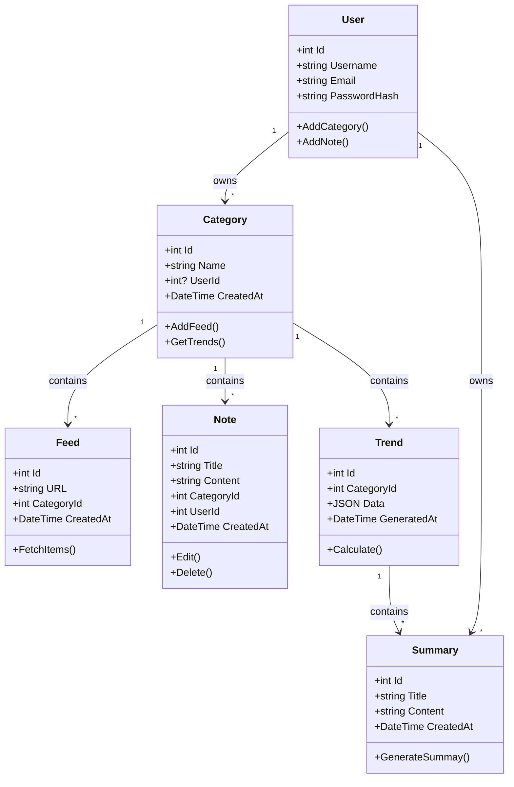

# Category Model

## Description

Représente une catégorie créée par un utilisateur ou générée par le système.
Chaque catégorie regroupe :

- des sources d’information (Feeds)
- des notes personnelles
- des tendances (Trends)

## Champs

- **Id (int)** – Identifiant unique
- **Name (string)** – Nom de la catégorie (max 80 caractères)
- **CreatedAt (DateTime)** – Date de création
- **UserId (int?)** – Propriétaire optionnel

## Relations

- 1 Category → plusieurs Feeds
- 1 Category → plusieurs Notes
- 1 Category → plusieurs Trends

# Feed Model

## Description

Représente une URL suivie par l’utilisateur. Utilisé pour la veille automatique.
Chaque Feed appartient à une catégorie.

## Champs

- **Id (int)** – Identifiant unique
- **URL (string)** – Lien (max 300)
- **CreatedAt (DateTime)** – Date de création
- **CategoryId (int)** – Clé étrangère vers Category

## Relations

- 1 Feed → 1 Category

# Note Model

## Description

Contenu écrit par l'utilisateur : idées, résumés, réflexions.
Associée à une catégorie pour organisation.

## Champs

- **Id (int)** – Identifiant unique
- **Title (string)** – Titre (max 200)
- **Content (string)** – Texte (max 5000)
- **CreatedAt (DateTime)** – Date de création
- **CategoryId (int)** – Clé vers Category
- **UserId (int?)** – Auteur optionnel (notes publiques ou privées)

## Relations

- 1 Note → 1 Category
- 0..1 Note → 1 User

# Trend Model

## Description

Mot-clé ou sujet détecté comme tendance (analyse automatique).
Chaque trend peut générer plusieurs résumés (Summaries).

## Champs

- **Id (int)** – Identifiant unique
- **Keyword (string)** – Sujet détecté (max 150)
- **Description (string?)** – Contexte (max 500)
- **CreatedAt (DateTime)** – Date de création
- **CategoryId (int)** – Classification
- **UserId (int?)** – Créateur optionnel (ex : trend custom)

## Relations

- 1 Trend → 1 Category
- 0..1 Trend → 1 User
- 1 Trend → plusieurs Summaries

## 📘 Summary — Résumé Automatique des Tendances

L'entité **Summary** représente un résumé généré automatiquement à partir des tendances
analysées dans les différentes catégories d'un utilisateur. Il s'agit d'un digest
journalier (ou à la demande) envoyé à l'utilisateur pour l'informer des évolutions
marquantes dans ses domaines de veille.

### ✨ Champs

- **Id** _(int)_ — identifiant unique
- **UserId** _(int)_ — utilisateur destinataire du résumé
- **CategoryId** _(int?)_ — catégorie concernée (optionnel)
- **Content** _(string)_ — contenu du résumé (texte, Markdown ou JSON)
- **CreatedAt** _(DateTime)_ — date de génération
- **TrendGeneratedAt** _(DateTime?)_ — date d'analyse des trends utilisés
- **SourceTrendIds** _(string)_ — liste JSON des trends ayant servi à créer le résumé

### 🔗 Relations

- Un **User** peut posséder plusieurs **Summaries**
- Un **Summary** s'appuie sur un ou plusieurs **Trends**
- Optionnellement associé à une **Category** pour un digest ciblé

### 🎯 Utilité

- Fournir des résumés quotidiens ou hebdomadaires
- Conserver un historique des synthèses
- Améliorer l’expérience utilisateur en rendant la veille simple et digeste

---
