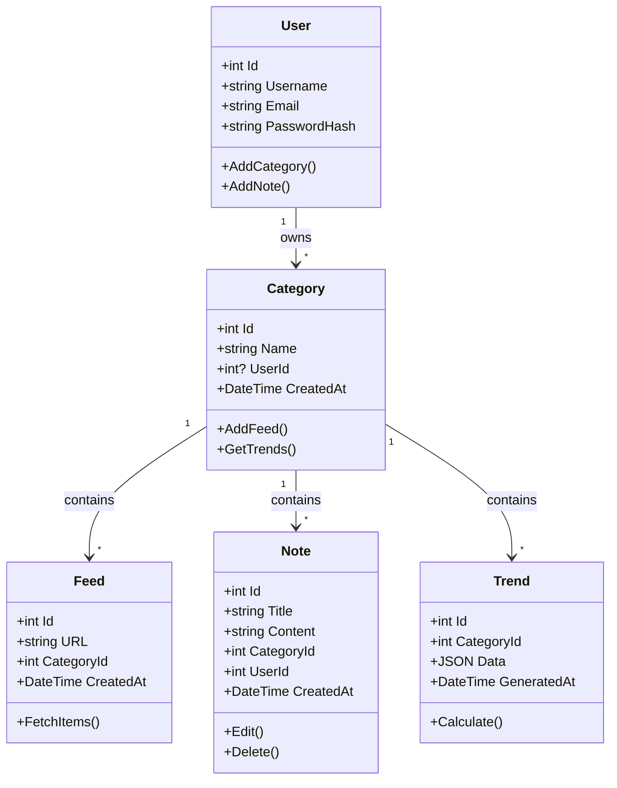

```mermaid
classDiagram
    class User {
        +int Id
        +string Username
        +string Email
        +string PasswordHash
        +AddCategory()
        +AddNote()
    }

    class Category {
        +int Id
        +string Name
        +int? UserId
        +DateTime CreatedAt
        +AddFeed()
        +GetTrends()
    }

    class Feed {
        +int Id
        +string URL
        +int CategoryId
        +DateTime CreatedAt
        +FetchItems()
    }

    class Note {
        +int Id
        +string Title
        +string Content
        +int CategoryId
        +int UserId
        +DateTime CreatedAt
        +Edit()
        +Delete()
    }

    class Trend {
        +int Id
        +int CategoryId
        +JSON Data
        +DateTime GeneratedAt
        +Calculate()
    }

    User "1" --> "*" Category : owns
    Category "1" --> "*" Feed : contains
    Category "1" --> "*" Note : contains
    Category "1" --> "*" Trend : contains
```
