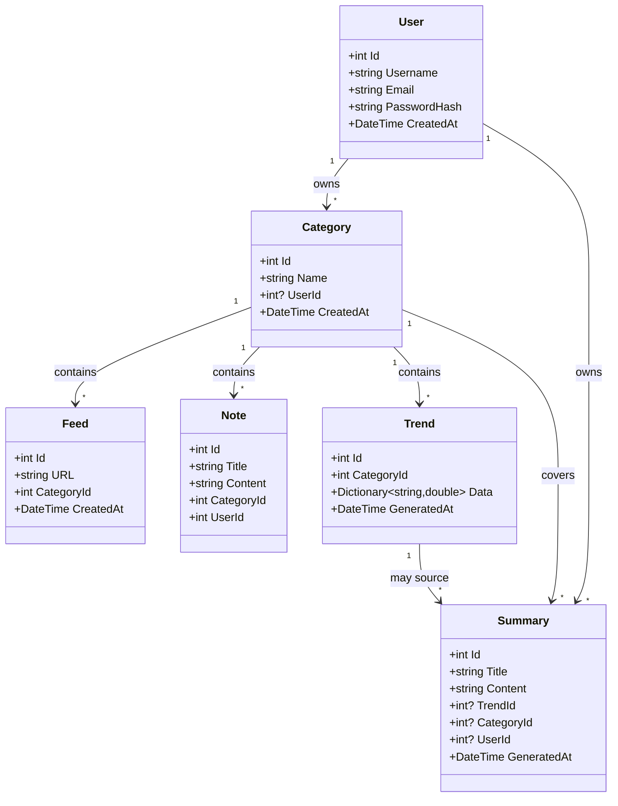

# PulseWatch – Tech Intelligence Dashboard

**PulseWatch** est une application **SaaS moderne** qui transforme la veille technologique en **flux d'information analysé, synthétisé et personnalisable par l'utilisateur**.
Chaque utilisateur peut créer ses propres catégories et suivre les tendances spécifiques à ses domaines d'intérêt, avec un digest quotidien produit par un agent IA.

> Pour installer, lancer et dépanner le projet, voir **[GUIDE.md](GUIDE.md)**.
> Ce fichier décrit *ce qu'est* PulseWatch ; le guide décrit *comment le faire tourner*.

---

## 📡 Fonctionnalités

- **Collecte automatique de flux RSS** : IA, DevOps, Node.js, C#, cybersécurité…
- **Analyse des tendances** : TF-IDF, scoring par catégorie.
- **Digest quotidien** : produit par un agent ADK hors process, qui déduplique les
  sujets et vérifie chaque affirmation contre les sources avant de publier.
- **Gestion des notes** : CRUD, tagging et recherche.
- **Multi-catégories personnalisables** : chaque utilisateur ajoute ses domaines.
- **Interface PWA** : responsive, dark mode, installation possible.
- **Backend en 4 couches** : C# ASP.NET Core.

---

## ⚙️ Stack Technique

| Composant | Choix |
| --------- | ----- |
| Frontend | React 19 + TypeScript + Vite + Tailwind CSS |
| Backend | C# ASP.NET Core, .NET 9 (4 couches : Core, Data, Business, API) |
| Base de données | SQL Server — LocalDB en développement, migrations EF Core |
| Agent de digest | Python 3.11+, Google ADK, FastAPI (processus séparé) |
| Authentification | JWT (HS256), clé fournie par la configuration |
| PWA | `vite-plugin-pwa` (Service Worker, manifest) |
| RSS | `SyndicationFeed` (System.ServiceModel.Syndication) |

---

## 🏗️ Architecture

Trois processus, deux dépôts de code, un seul propriétaire du schéma.

```
┌─────────────┐   HTTP /api   ┌──────────────────┐  HTTP /digest  ┌───────────────┐
│  frontend   │ ────────────► │  PulseWatch.API  │ ─────────────► │  agent/       │
│ React+Vite  │ ◄──────────── │  ASP.NET Core    │ ◄───────────── │ FastAPI + ADK │
│  :3000      │               │  :5000 / :7171   │    Digest      │  :8087        │
└─────────────┘               └────────┬─────────┘                └───────┬───────┘
                                       │ EF Core                          │ HTTP
                                       ▼                                  ▼
                                 ┌───────────┐                      flux RSS publics
                                 │ SQL Server│                      (lecture d'articles)
                                 └───────────┘
```

L'agent ne touche jamais la base : il reçoit des articles, il rend un digest.
Le backend reste seul propriétaire du schéma.

```
pulse-watch/
├── backend/
│   ├── PulseWatch.Core/       # Entités, DTOs, interfaces, profils AutoMapper
│   ├── PulseWatch.Data/       # DbContext, repositories, UnitOfWork
│   ├── PulseWatch.Business/   # Services métier + client HTTP de l'agent
│   └── PulseWatch.API/        # Controllers, Program.cs, migrations EF
├── agent/                     # Agent de digest (Python, ADK, FastAPI)
│   ├── digest_agent/          # agent.py, service.py, tools.py, schemas.py
│   ├── tests/                 # pytest
│   ├── Dockerfile             # + docker-compose.yml
│   └── README.md              # le graphe et les décisions de conception
├── frontend/
│   └── src/                   # components, context, hooks, pages, services
├── GUIDE.md                   # installation, exécution, dépannage
├── DATABASE_SCHEMA.md
└── readme.md
```

---

## 🧩 Modèle de Données



`Summary.TrendId` et `Summary.CategoryId` sont tous deux nullables : un digest de
catégorie n'est rattaché à aucun trend, et les lignes antérieures à `CategoryId`
n'ont que leur trend. Détail dans [DATABASE_SCHEMA.md](DATABASE_SCHEMA.md).

---

## 🚀 Démarrage

Le détail — prérequis, configuration, dépannage — est dans **[GUIDE.md](GUIDE.md)**.
En résumé, trois processus à lancer :

```bash
# 1. API  (une clé JWT est obligatoire : sans elle l'API refuse de démarrer)
cd backend/PulseWatch.API
Jwt__Key="$(openssl rand -base64 48)" dotnet run

# 2. Agent de digest
cd agent && docker compose up -d          # ou : uvicorn digest_agent.service:app --port 8087

# 3. Frontend
cd frontend && npm install && npm run dev
```

---

## 🔧 Configuration

Aucun secret n'est versionné : `appsettings.json` n'en contient plus, et les
`.env` sont ignorés par git. Le double souligné correspond à l'imbrication .NET
(`Jwt__Key` → section `Jwt`, clé `Key`).

### Backend

| Variable | Obligatoire | Rôle |
| --- | --- | --- |
| `ConnectionStrings__DefaultConnection` | oui | chaîne de connexion SQL Server |
| `Jwt__Key` | **oui** | signature des jetons, 32 caractères minimum |
| `Jwt__Issuer` / `Jwt__Audience` | non | `PulseWatch` par défaut |
| `DigestAgent__BaseUrl` | **oui** | URL de l'agent, ex. `http://127.0.0.1:8087` |
| `Cors__AllowedOrigins__0` | en prod | origines autorisées, une par index |

L'API refuse de démarrer si `Jwt__Key` ou `DigestAgent__BaseUrl` manquent —
plutôt que d'échouer au premier appel, ou de signer avec une clé connue.

### Agent

Voir `agent/.env.example`. Le modèle se choisit par `DIGEST_MODEL` (Gemini natif,
ou tout provider via LiteLLM).

### Frontend

Voir `frontend/.env.example`. En développement, `VITE_API_URL=/api` passe par le
proxy Vite et évite toute question de CORS.

---

## 📊 API

Toutes les routes sont sous `/api`, et toutes exigent un jeton sauf `/api/Auth/*`.

### Authentication
- `POST /api/Auth/register` · `POST /api/Auth/login`
- `POST /api/Auth/refresh` · `POST /api/Auth/logout` · `POST /api/Auth/validate`

### Categories
- `GET|POST /api/Category` · `GET|PUT|DELETE /api/Category/{id}`
- `GET /api/Category/{id}/feeds` · `/notes` · `/trends`

### Feeds
- `GET|POST /api/Feed` · `GET|DELETE /api/Feed/{id}`
- `GET /api/Feed/{id}/fetch` — lit et parse le flux
- `GET /api/Feed/category/{categoryId}`

### Notes
- `GET|POST /api/Note` · `GET|PUT|DELETE /api/Note/{id}`

### Trends
- `GET /api/Trend` · `GET /api/Trend/{id}`
- `GET /api/Trend/category/{categoryId}` · `/latest`
- `POST /api/Trend/category/{categoryId}/generate`

### Summaries
- `GET /api/Summary` · `GET /api/Summary/{id}` · `GET /api/Summary/daily`
- `GET /api/Summary/user/{userId}` · `GET /api/Summary/category/{categoryId}`
- `POST /api/Summary/category/{categoryId}/generate` — digest de catégorie
- `POST /api/Summary/trend/{trendId}/generate` — digest à partir d'un trend

### Dashboard
- `GET /api/Dashboard/stats` · `/activity` · `/categories`

### Users
- `GET /api/User` · `GET|PUT|DELETE /api/User/{id}`
- `POST /api/User/{id}/change-password`
- `GET /api/User/check-email/{email}` · `/check-username/{username}`

Swagger est servi à la racine de l'API en développement.

---

## 📱 PWA

Service Worker et manifest via `vite-plugin-pwa` : installation sur desktop et
mobile, écran hors ligne, mise en cache des assets.

---

## 🎯 Roadmap

### Version 1.0.0
- [x] Architecture 4 couches
- [x] Authentification JWT
- [x] CRUD Categories / Feeds / Notes
- [x] Frontend React TypeScript
- [x] Interface PWA responsive

### Version 1.1.0 (en cours)
- [x] Analyse TF-IDF des tendances
- [x] Digest quotidien par agent ADK (déduplication + vérification des sources)
- [ ] Rendu Markdown des digests dans l'interface
- [ ] Notifications push
- [ ] Mode dark complet

La suite reste à définir.

---

## 👥 Contributeurs

- **HexaNexus28** — conception et développement
- **[Claude Code](https://claude.com/claude-code)** (Claude Opus 5) — contributeur :
  agent de digest, correctifs backend et frontend, documentation.
  Les commits correspondants portent un `Co-Authored-By`.

---

**PulseWatch** — Votre veille technologique, intelligente et automatisée.
