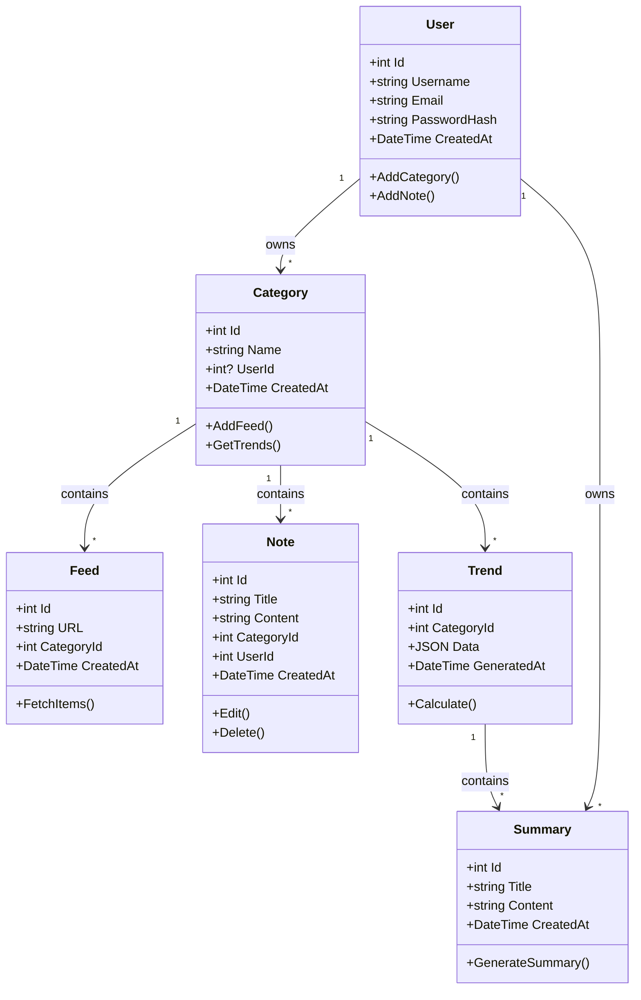

# PulseWatch – Tech Intelligence Dashboard

**PulseWatch** est une application **SaaS moderne** qui transforme la veille technologique en **flux d'information analysé, synthétisé et personnalisable par l'utilisateur**.  
Chaque utilisateur peut créer ses propres catégories et suivre les tendances spécifiques à ses domaines d'intérêt, avec un résumé quotidien automatique.

---

## 📡 Fonctionnalités

- **Collecte automatique de flux RSS** : IA, DevOps, Node.js, C#, cybersécurité…
- **Analyse des tendances** : TF-IDF, clustering, scoring par catégorie.
- **Résumé quotidien** : digest clair et actionnable par catégorie.
- **Gestion des notes** : CRUD, tagging et recherche full-text.
- **Multi-catégories personnalisables** : chaque utilisateur peut ajouter ses domaines et suivre l'évolution.
- **Interface PWA moderne** : responsive, dark mode, installation possible.
- **Backend scalable et robuste** : C# ASP.NET Core, Docker-ready.
- **Frontend React TypeScript** : architecture moderne avec hooks et context.

---

## ⚙️ Stack Technique

| Composant       | Choix                                                   |
| --------------- | ------------------------------------------------------- |
| Frontend        | React 19 + TypeScript + Vite + Tailwind CSS              |
| Backend         | C# ASP.NET Core (4 couches : Core, Data, Business, API) |
| Base de données | SQLite (début), SQL Server/PostgreSQL pour scale        |
| PWA             | Service Worker, Manifest, Offline Support                 |
| RSS Engine      | Custom service + background service                      |
| Déploiement     | Docker + PaaS ou VPS                                    |

---

## 🏗️ Architecture du Projet

```
pulse-watch/
├── backend/                    # Backend C# ASP.NET Core
│   ├── PulseWatch.API/        # API Controllers
│   ├── PulseWatch.Business/    # Business Logic
│   ├── PulseWatch.Core/       # Entities & Interfaces
│   └── PulseWatch.Data/       # Data Access Layer
├── frontend/                   # Frontend React TypeScript
│   ├── src/
│   │   ├── components/        # Composants réutilisables
│   │   ├── context/          # React Context (Auth, etc.)
│   │   ├── hooks/            # Hooks personnalisés
│   │   ├── pages/            # Pages de l'application
│   │   ├── styles/           # CSS et styles
│   │   ├── types/            # Types TypeScript
│   │   ├── utils/            # Utilitaires
│   │   └── config/           # Configuration API
│   ├── public/               # Fichiers statiques PWA
│   └── server.js            # Serveur Express pour production
└── docs/                     # Documentation
```

---

## 🧩 Modèle de Données

### Entités Principales



---

## 🚀 Installation & Démarrage Rapide

### Prérequis

- Node.js 18+
- .NET 8.0+
- Docker (optionnel)

### Backend

```bash
# Cloner le projet
git clone https://github.com/HexaNexus28/pulse-watch.git
cd pulse-watch/backend

# Restaurer les dépendances
dotnet restore

# Lancer l'API
cd PulseWatch.API
dotnet run
```

L'API sera disponible sur `https://localhost:7171`

### Frontend

```bash
# Aller dans le dossier frontend
cd ../frontend

# Installer les dépendances
npm install

# Copier les variables d'environnement
cp .env.example .env

# Lancer le serveur de développement
npm run dev
```

L'application sera disponible sur `http://localhost:3000`

### Production avec Docker

```bash
# Construire les images
docker-compose build

# Lancer les services
docker-compose up -d
```

---

## 📱 Fonctionnalités PWA

L'application est une **Progressive Web App** avec :

- **Installation** : Possible d'installer sur desktop et mobile
- **Offline Support** : Fonctionnalités de base disponibles hors ligne
- **Notifications Push** : Alertes pour nouvelles tendances
- **Background Sync** : Synchronisation des données lors de la reconnexion
- **Responsive Design** : Adapté à tous les écrans

---

## 🔧 Configuration

### Variables d'Environnement

#### Backend (.env)
```env
ConnectionStrings__DefaultConnection=Data Source=pulsewatch.db
JWT__Secret=votre-secret-key
JWT__Expiration=3600
RSS__UpdateInterval=3600
```

#### Frontend (.env)
```env
VITE_API_URL=https://localhost:7171/api
VITE_ENABLE_PWA=true
VITE_ENABLE_DEBUG=false
```

---

## 🛠️ Scripts Disponibles

### Backend
```bash
dotnet run                    # Lancer l'API
dotnet build                  # Compiler le projet
dotnet test                   # Lancer les tests
dotnet ef database update     # Migrer la base de données
```

### Frontend
```bash
npm run dev                   # Serveur de développement
npm run build                 # Build de production
npm run serve                 # Serveur Express (production)
npm run lint                  # ESLint
npm run type-check            # Vérification TypeScript
```

---

## 📊 API Endpoints

### Authentication
- `POST /api/auth/login` - Connexion
- `POST /api/auth/register` - Inscription
- `GET /api/auth/profile` - Profil utilisateur

### Categories
- `GET /api/categories` - Lister les catégories
- `POST /api/categories` - Créer une catégorie
- `PUT /api/categories/{id}` - Mettre à jour
- `DELETE /api/categories/{id}` - Supprimer

### Feeds
- `GET /api/feeds` - Lister les flux RSS
- `POST /api/feeds` - Ajouter un flux
- `POST /api/feeds/{id}/fetch` - Récupérer les articles

### Notes
- `GET /api/notes` - Lister les notes
- `POST /api/notes` - Créer une note
- `PUT /api/notes/{id}` - Mettre à jour
- `DELETE /api/notes/{id}` - Supprimer

### Trends & Summaries
- `GET /api/trends` - Analyse des tendances
- `GET /api/summaries` - Résumés quotidiens
- `POST /api/summaries/generate` - Générer un résumé

---

## 🎯 Roadmap

### Version 1.0.0 
- [x] Architecture de base
- [x] Authentification JWT
- [x] CRUD Categories/Feeds/Notes
- [x] Frontend React TypeScript
- [x] Interface PWA responsive

### Version 1.1.0 (En cours)
- [ ] Analyse TF-IDF des tendances
- [ ] Génération automatique de résumés
- [ ] Notifications push
- [ ] Mode dark complet

### Version 2.0.0 (Planifié)
- [ ] Multi-tenant SaaS
- [ ] Dashboard analytique avancé
- [ ] API publique pour partenaires
- [ ] Plugin system
- [ ] Mobile app native


---


**PulseWatch** - Votre veille technologique, intelligente et automatisée. 
